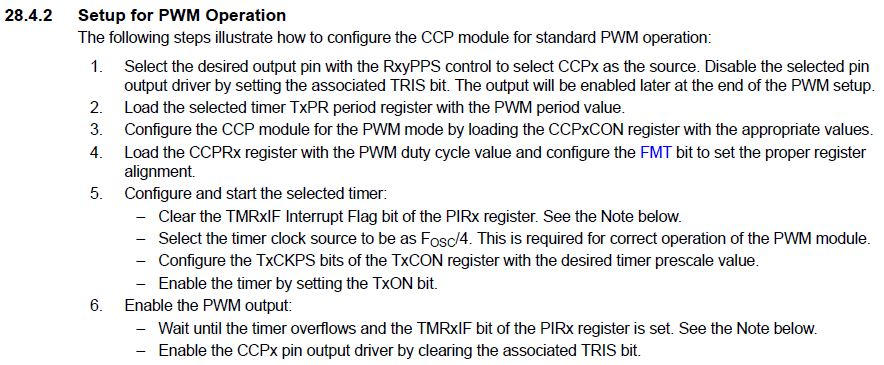
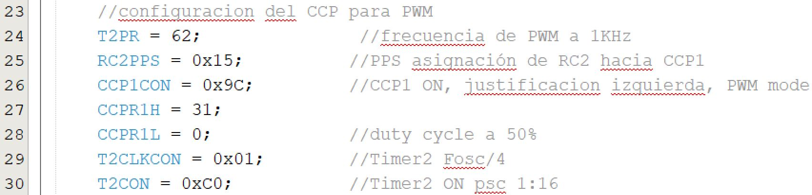

Procedimiento para configurar el CCP en modo PWM 
 
Para 1KHz de frecuencia y 50% de duty cycle: 
 
NOTA: Se debe de contemplar configuración del puerto RC2 como salida digital (TRISC.2 = 0 y ANSELC.2=0) 
